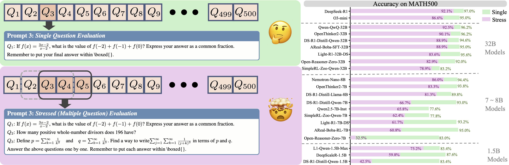
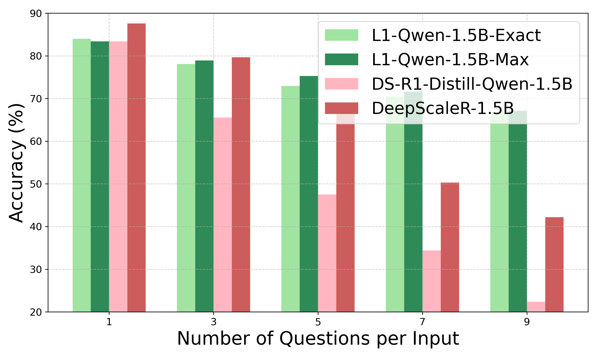
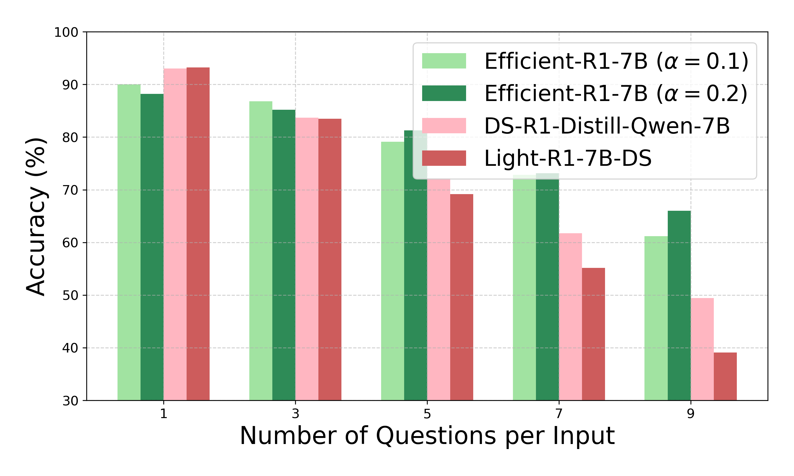
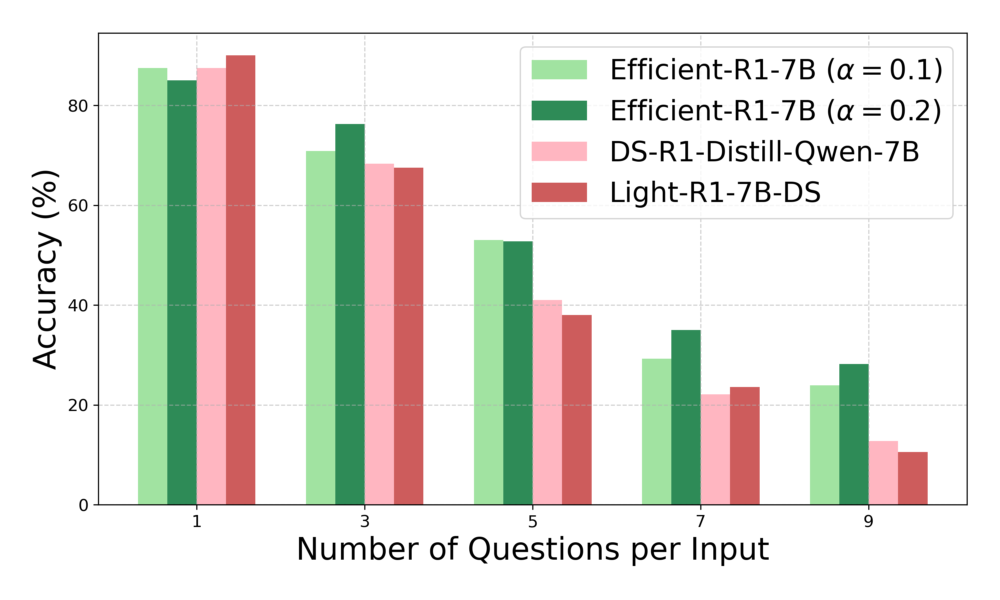
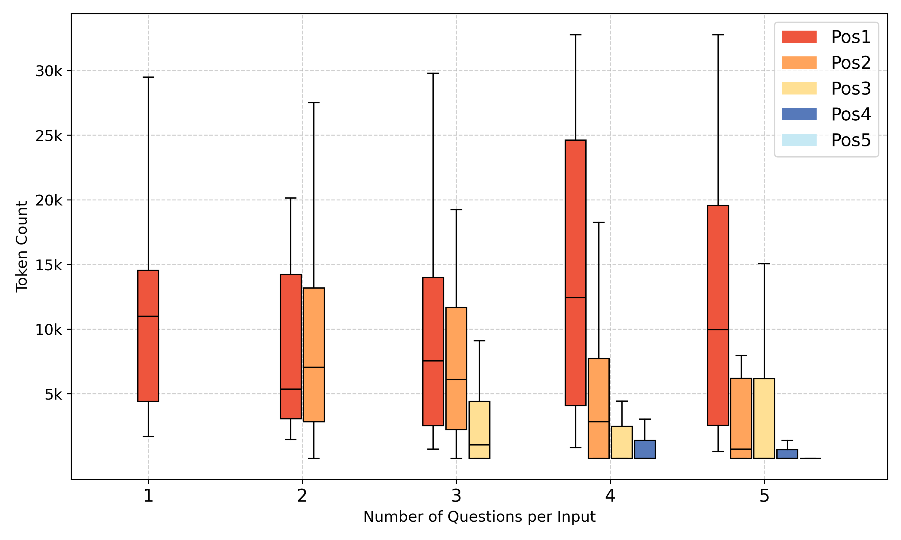
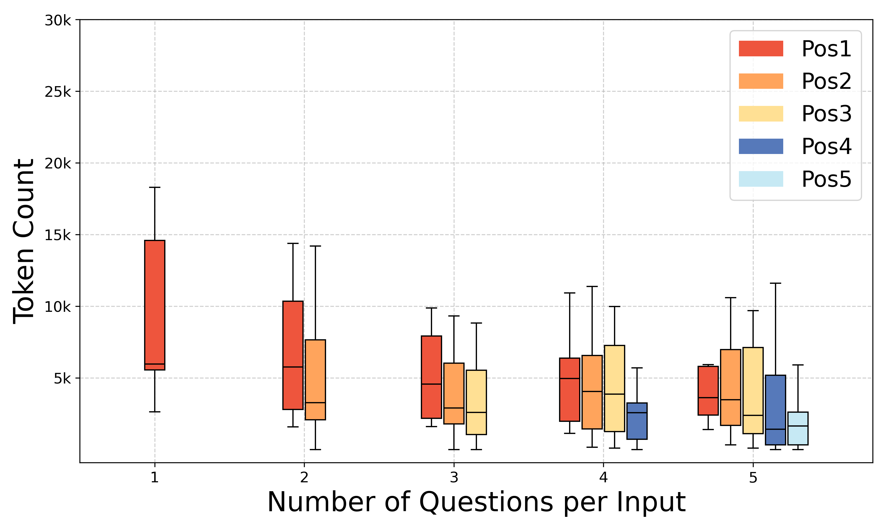
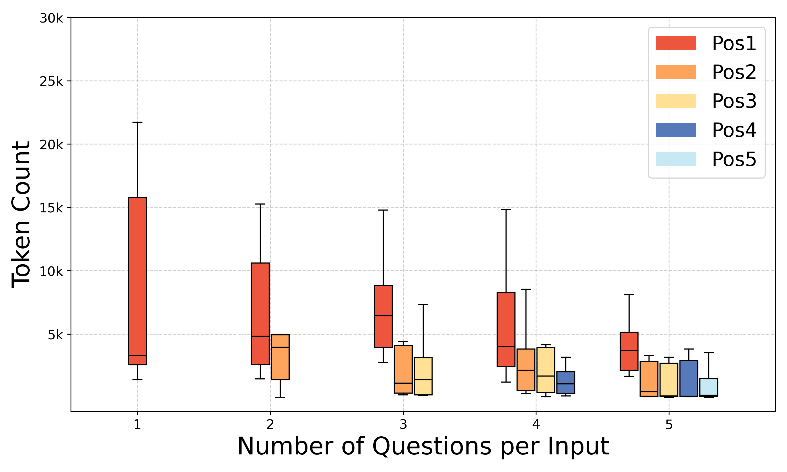

<div align="center">
<h1>📉 REST: Stress Testing Large Reasoning Models by Asking Multiple Problems at Once</h1>

<p align="center">
  <a href="https://github.com/opendatalab/REST">
    
  </a>
  <a href="https://arxiv.org/abs/2507.10541">
    
  </a>
  <a href="https://opendatalab.github.io/REST">
    
  </a>
    <a href="https://github.com/opendatalab/REST/tree/main?tab=readme-ov-file#-quick-start">
    
    </a>
</p>
</div>

<p align="center" width="100%">
<a ></a>
</p>

## 📝 Key Takeaways
📉 **Even SOTA models like DeepSeek-R1 exhibit substantial performance degradation under stress testing.**

> Tabel: Performance of DeepSeek-R1 under traditional single-question testing (single) and multi-question stress testing (stress).

| Mode | GSM8K | MATH500  | AMC23 | AIME24 | AIME25 | GPQA Diamond | LiveCodeBench(v5) |
| ----- |------| ---- |------| ------- | ----- | ----- | ----- |
| Single | 96.20 | 97.00 | 93.75 | 81.66 | 68.75 | 70.20 | 63.44 |
| Stress | 96.16 | 92.09 | 81.80 | 52.49 | 37.17 | 64.63 | 40.83 | 

📊 **REST enhances the discriminative power of existing benchmarks, revealing pronounced performance differences among models that exhibit similar, near-ceiling performance under single-question evaluations.**

> Tabel: Performance of different LRMs on MATH500 under multi-question stress testing (stress).

| Mode | DS-R1-1.5B | L1-Qwen-1.5B-Max | DS-R1-7B | AReaL-boba-RL-7B | OpenR1-Qwen-7B | Nemotron-Nano-8B | DS-R1-32B | DeepSeek-R1 |
| ----- |------| ---- |------| ------- | ----- | ----- | ----- | ----- |
| Single | 83.40 | 83.40 | 93.00 | 95.00 | 92.20 | 94.40 | 94.60 | 97.00 |
| Stress | 42.47 | 73.23 | 66.75 | 60.77 | 81.64 | 86.04 | 88.97 | 92.09 |

💡 **"Overthinking" is a ritical factor contributing to the performance degradation and "Long2short" technique can help.**

> Figure: The effect of Long2Short training. Long2Short training mitigates the performance degradation under high stress levels (number of questions per input).

<table width="100%">
    <tr align="center">
        <td width="33%">
            
            <p>1.5B Models on MATH500</p>
        </td>
        <td width="33%">
            
            <p>7B Models on MATH500</p>
        </td>
        <td width="33%">
            
            <p>7B Models on AMC23</p>
        </td>
    </tr>
</table>

✅ **Stress testing capable LRMs employ concise reasoning for earlier questions.**

> Figure: The reasoning token count for questions at different positions on AIME24 under stress testing.

<table width="100%">
    <tr align="center">
        <td width="33%">
            
            <p>DS-R1-Distill-Qwen-7B</p>
        </td>
        <td width="33%">
            
            <p>Nemotron-nano-7B</p>
        </td>
        <td width="33%">
            
            <p>DeepSeek-R1</p>
        </td>
    </tr>
</table>

<h3 id="env">🚀 Quick Start</h3>
LEMMA mainly requires the following three packages. To install them, simply run "bash sh/install.sh":

- [OpenCompass](https://github.com/open-compass/opencompass)
- [LMDeploy](https://github.com/InternLM/lmdeploy)
- [math-verify](https://github.com/huggingface/Math-Verify)

After installation, run the following scripts to reproduce our evaluation results. To evaluate API-based models, please specify the  "OPENAI_API_BASE" and "OPENAI_API_KEY" in these scripts.

```bash
bash sh/eval_math.sh
# Code data will be automatically downloaded from OpenCompass
bash sh/eval_code.sh
```

To evaluate gpqa, we use [gemma-3-27b-it](https://huggingface.co/google/gemma-3-27b-it) to extract the answer for each question because LRMs othen fail to put each answer within "\boxed{}". We use SGLang to deploy gemma-3-27b-it, you can install it in another environment.

```bash
# Install sglang==0.4.4.post3 in another environment.
conda create -n sglang044 -y
conda activate sglang044
pip install --upgrade pip
pip install uv
uv pip install "sglang[all]==0.4.4.post3"
```

Set "VERIFYER_MODEL_NAME", "VERIFYER_API_BASE", "VERIFYER_API_KEY" in "sh/eval_gpqa.sh" and run inference and evaluation separately.

```bash
bash sh/eval_gpqa.sh infer
bash sh/serve_gemma3.sh &
bash sh/eval_gpqa.sh eval
```

To evaluate your own model, you can set "MODEL_NAME" (a valid huggingface model name), "TP_SIZE" and "TEMPERATURE" in "eval_custom_model.sh".

```bash
bash sh/eval_huggingface_model.sh
```

Thanks for the open source code of [OpenCompass](https://github.com/open-compass/opencompass).

## Citation

Please cite the paper if you refer to our code, result or paper.

```bibtex
@misc{pan2025REST,
    title={REST: Stress Testing Large Reasoning Models by Asking Multiple Problems at Once}, 
    author={Zhuoshi Pan and Qizhi Pei and Yu Li and Qiyao Sun and Zinan Tang and H. Vicky Zhao and Conghui He and Lijun Wu},
    year={2025},
    eprint={2507.10541},
    archivePrefix={arXiv},
    primaryClass={cs.CL},
    url={https://arxiv.org/abs/2507.10541}, 
}
```
